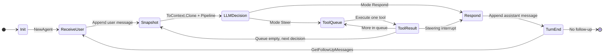

# agent-core

Agent framework for LLM-driven decision and tool execution with explicit state and context boundaries.

## Architecture

- **Agent** (`packages/agent/core`) – Holds mutable **AgentState**, runs the turn loop, and emits events. Each turn may involve multiple LLM calls and tool runs.
- **AgentState** / **AgentContext** (`packages/agent/types`) – **AgentState** is the single mutable runtime (messages, streaming flags, pending tool calls, error). **AgentContext** is an immutable snapshot (system prompt, messages, tools) used for LLM and transform boundaries.
- **Pipeline** (`packages/agent/transform`) – Transforms and converts messages before the LLM. Accepts an **AgentContext** snapshot via `TransformContext()` so transforms see immutable state.
- **Provider** (external `agent-mind/provider`) – LLM completion and tool-call handling.
- **ToolRegistry** (`packages/agent/tools`) – Register tools by name; the agent executes them (in parallel when the orchestrator batches tool calls) and appends tool results to state.
- **Types** (`packages/agent/types`) – **AgentMessage** (user, assistant, tool result), **ContentBlock**, **Message** (LLM-facing), and **ToolLister** for context-safe tool listing.

## Message and state flow

1. **User message** – Appended to `AgentState.Messages`.
2. **Snapshot** – Before each LLM call, `state.ToContext().Clone()` yields an **AgentContext** (system prompt, messages, tools). The pipeline runs on this snapshot to produce LLM-ready messages.
3. **Steering decision** – The LLM returns either **respond** (text) or **steer** (tool calls). When steering, tool calls are enqueued and **PendingToolCalls** are set on state.
4. **Tool execution** – Tools run (in parallel when the LLM issues multiple tool calls); each result is appended to **Messages** and the corresponding **PendingToolCalls** entry is removed. The main agent sees all results—including delegation traces and errors—and can rectify failures (e.g. retry with a different tool or intent). Steering interrupts can drain the queue and inject alternate messages.
5. **Response** – When the LLM responds with text, **IsStreaming** is set during delta emission, then the final **AssistantMessage** is appended and the turn ends.
6. **Follow-up** – If **GetFollowUpMessages** returns messages, they are appended and another turn starts; otherwise the stream ends with the current **Messages**.

## State flow diagram

## Extension points

- **Orchestrator** – The turn loop is driven by **AgentConfig.Orchestrator**. Orchestrators live in **packages/agent/orchestrators/** (e.g. **agentic**). Import `_ "github.com/biome/agent-core/packages/agent/orchestrators/agentic"` to use the default agentic loop when Orchestrator is nil. Implement the **Orchestrator** interface to plug in other arrangements (e.g. ReAct, plan-and-execute).
- **Tools** – Implement `tools.Tool` (Name, Description, Parameters, Execute) and register with `AgentConfig.Tools`. The registry is exposed on **AgentState** / **AgentContext** via **ToolLister** (e.g. `ListTools()`).
- **Transforms** – Use **Pipeline** with a **TransformFunc** (filter/rewrite `[]AgentMessage`) and **ConvertFunc** (to `[]Message`). The pipeline is invoked with an **AgentContext** snapshot before each steering decision.
- **Steering** – **GetSteeringMessages** can interrupt after a tool run and inject messages; **GetFollowUpMessages** can add messages after a turn to continue the conversation.

## Quick start

- **Build**: `go build ./...`
- **Tests**: `go test ./...`
- **Demo**: `go run ./cmd/demo`
- **HTTP API**: `go run ./cmd/http-server`

Configuring an agent: set **AgentConfig** (SystemPrompt, Pipeline, Tools, Provider, optional GetSteeringMessages / GetFollowUpMessages), then call **Prompt(ctx, userMessage)** and consume the returned **EventStream** until it ends.
