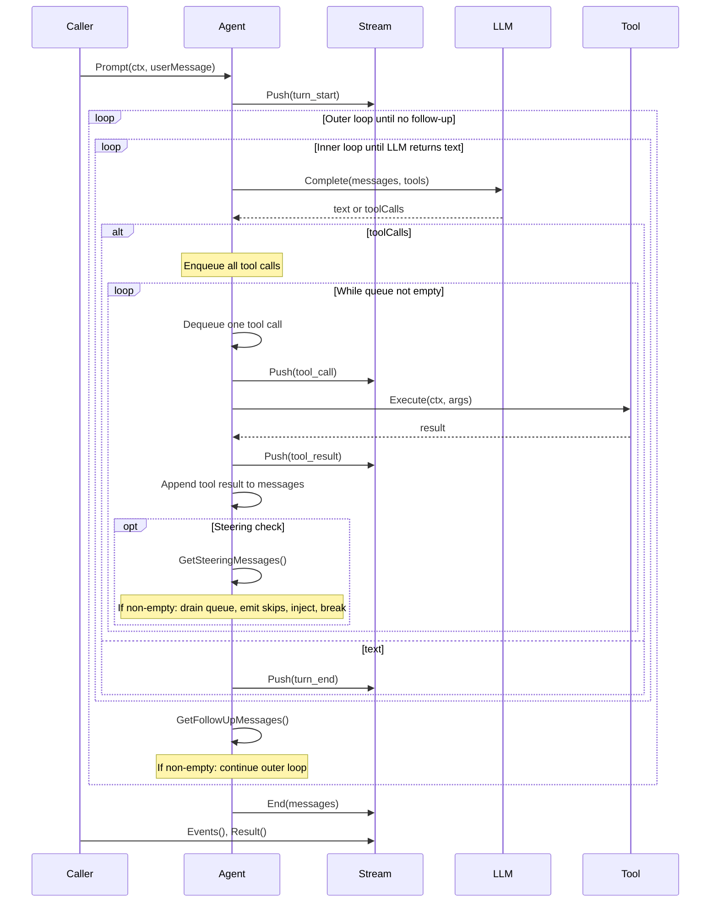

# agent-core

Stateful agent with sequential tool execution and event streaming.

## Quick Start

```go
import (
    "context"
    "github.com/biome/agent-core/packages/agent/core"
    "github.com/biome/agent-core/packages/agent/tools"
    "github.com/biome/agent-core/packages/agent/types"
    "github.com/biome/agent-mind/openrouter"
)

// Create provider and tools
provider := openrouter.NewProvider(apiKey, "gpt-4o")
registry := tools.NewToolRegistry()
registry.Register(&tools.CalculatorTool{})

// Create agent
agent := core.NewAgent(core.AgentConfig{
    SystemPrompt: "You are a helpful assistant.",
    Provider:     provider,
    Tools:        registry,
})

// Prompt and consume events
stream := agent.Prompt(context.Background(), types.UserMessage{
    Content: []types.ContentBlock{types.TextContent{Text: "What is 15 * 3?"}},
})

for event := range stream.Events() {
    switch event.Type {
    case core.EventToolCall:
        fmt.Println("Tool:", event.Payload.(core.ToolCallPayload).ToolName)
    case core.EventTextDelta:
        fmt.Print(event.Payload.(core.TextDeltaPayload).Text)
    }
}

messages, _ := stream.Result()
```

## Core Concepts

### AgentMessage vs LLM Message

The agent works with `AgentMessage`, a flexible interface that includes:
- Standard LLM messages (`UserMessage`, `AssistantMessage`, `ToolResultMessage`)
- Custom app-specific message types

LLMs only understand user, assistant, and toolResult. The `Pipeline` (via `convertToLlm`) bridges this gap by filtering and transforming messages before each LLM call.

### Sequential Tool Execution

When the LLM returns tool calls, they are executed **one at a time** via a queue:
1. All tool calls are enqueued
2. Dequeue and execute one tool
3. Append tool result to messages
4. Check for steering messages (interrupt)
5. If steering: drain queue (emit skip results), inject steering messages, break
6. Otherwise: continue to next tool in queue
7. After queue empty: call LLM again for next decision

This ensures tools run sequentially with opportunity to interrupt between each.

### Steering and Follow-up

**Steering** interrupts the agent mid-execution. After each tool completes, `GetSteeringMessages()` is called. If it returns messages, remaining tools are skipped and those messages are injected before the next LLM call.

**Follow-up** queues work after the agent would otherwise stop. When the LLM returns text (no more tools), `GetFollowUpMessages()` is called. If it returns messages, they are added and another turn begins.

## Event Flow



### Event Types

| Event | Description |
|-------|-------------|
| `turn_start` | New turn begins |
| `steering_mode` | Decision mode (respond or steer) |
| `thinking` | LLM thinking/reasoning text |
| `tool_call` | Tool execution starts |
| `tool_result` | Tool execution completes |
| `text_delta` | Incremental text response |
| `turn_end` | Turn completes with assistant message |

### With Tool Calls

```
Prompt("Calculate 15*3 and 10+5")
├─ turn_start
├─ steering_mode { mode: "steer", queueSize: 2 }
├─ tool_call { toolName: "calculator", args: {expression: "15*3"} }
├─ tool_result { result: 45 }
├─ tool_call { toolName: "calculator", args: {expression: "10+5"} }
├─ tool_result { result: 15 }
├─ steering_mode { mode: "respond" }
├─ text_delta "15*3 = 45 and 10+5 = 15"
└─ turn_end
```

## Configuration

```go
type AgentConfig struct {
    // System prompt for the LLM
    SystemPrompt string

    // Transform pipeline for message conversion
    Pipeline *transform.Pipeline

    // Available tools
    Tools *tools.ToolRegistry

    // LLM provider
    Provider provider.Provider

    // Called after each tool execution; return messages to interrupt
    GetSteeringMessages GetSteeringMessagesFunc

    // Called when agent would stop; return messages to continue
    GetFollowUpMessages GetFollowUpMessagesFunc

    // Turn loop driver. Nil = default agentic loop (steering + tools + respond).
    // Set to use another orchestration strategy (e.g. ReAct, plan-and-execute).
    Orchestrator core.Orchestrator
}
```

### Configurable turn loop (Orchestrator)

The turn loop is configurable via **Orchestrator**, similar to how agent-mind uses providers (e.g. openrouter). Common pieces (agent, events, steering, queue) stay in **core**; orchestrator implementations live in **packages/agent/orchestrators/**.

- **Default (agentic loop):** Import the agentic orchestrator so it registers as the default:
  ```go
  import _ "github.com/biome/agent-core/packages/agent/orchestrators/agentic"
  ```
  Then leave `AgentConfig.Orchestrator` nil to use the default (steering → tools → respond → follow-up).

- **Custom orchestrators:** Implement the `core.Orchestrator` interface and set `AgentConfig.Orchestrator`. The interface has a single method:
  ```go
  Run(ctx context.Context, agent *Agent, userMessage types.UserMessage, eventStream *stream.EventStream[AgentEvent, []types.AgentMessage])
  ```
  The orchestrator drives one turn: it reads and writes agent state (via `agent.State()`, `agent.Config()`, `agent.SteeringDecision()`, `agent.ExecuteTool()`), pushes events to the stream, and must call `eventStream.End(messages)` or `eventStream.EndWithError(err)` when the turn is done.

## Context Cancellation

Pass a cancellable context to `Prompt()`. The agent checks `ctx.Done()` before LLM calls and tool executions. Tools receive the context and should respect cancellation.

```go
ctx, cancel := context.WithTimeout(context.Background(), 30*time.Second)
defer cancel()

stream := agent.Prompt(ctx, userMessage)
```

## Methods

```go
// Start a new prompt
stream := agent.Prompt(ctx, userMessage)

// Get conversation history
messages := agent.Messages()

// Clear conversation
agent.Reset()
```

## License

MIT
