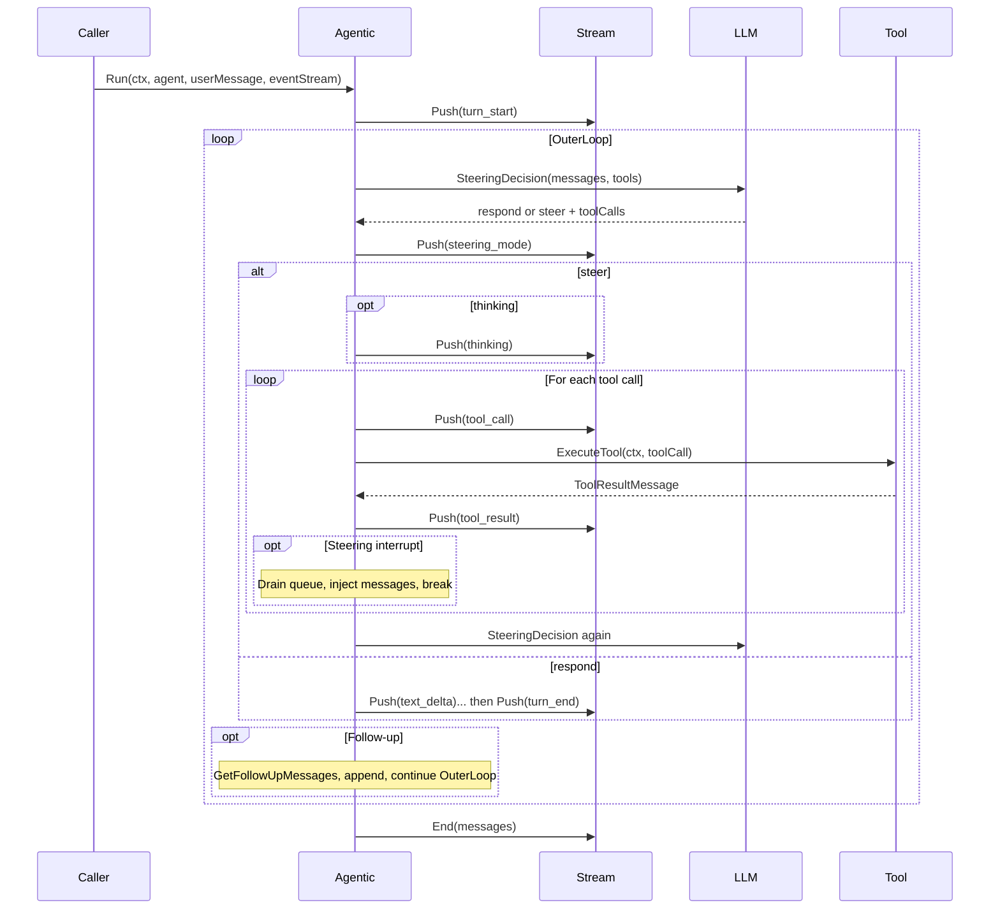
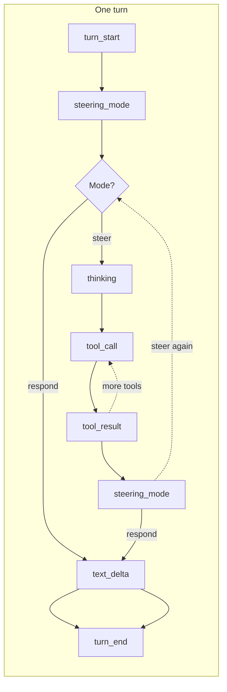

# Agentic orchestrator

Default turn loop: the LLM makes a **steering decision** each time (respond with text or steer with tool calls). When it steers, tool calls are enqueued and executed one-by-one; after each tool result the LLM is called again until it responds with text. Optional **steering** (interrupt and inject messages) and **follow-up** (continue the turn with extra messages) are supported.

## Event pattern

Events are pushed to the stream in this order. The inner loop (steer → tools → decision) repeats until the LLM returns text; the outer loop repeats if follow-up messages are added.

### Sequence diagram



### Event flow (linear view)



### Event types emitted

| Event | Payload | When |
|-------|---------|------|
| `turn_start` | `TurnStartPayload` (Timestamp) | Start of turn; again on each follow-up iteration |
| `steering_mode` | `SteeringModePayload` (Mode, QueueSize) | After each LLM decision (respond vs steer, and how many tool calls) |
| `thinking` | `ThinkingPayload` (Text) | When the LLM returns steer and optional thinking text |
| `tool_call` | `ToolCallPayload` (ToolCallId, ToolName, Args) | Before each tool execution |
| `tool_result` | `ToolResultPayload` (ToolCallId, ToolName, Result, Error) | After each tool execution |
| `text_delta` | `TextDeltaPayload` (Text, Index) | Chunks of the final assistant reply |
| `turn_end` | `TurnEndPayload` (Message, Duration) | When the turn finishes with an assistant message |

This orchestrator does **not** emit `plan_created`, `plan_step_start`, or `plan_step_end`; those are used by the plan-execute orchestrator.

### Example event sequence (tool use)

```
turn_start
steering_mode { mode: "steer", queueSize: 2 }
thinking { text: "I'll use calculator for both." }
tool_call { toolName: "calculator", args: { expression: "15*3" } }
tool_result { result: 45 }
tool_call { toolName: "calculator", args: { expression: "10+5" } }
tool_result { result: 15 }
steering_mode { mode: "respond" }
text_delta "15*3 = 45 and 10+5 = 15"
turn_end
```

## Usage

Import the package so it registers as the default orchestrator, then leave `AgentConfig.Orchestrator` nil:

```go
import _ "github.com/biome/agent-core/packages/agent/orchestrators/agentic"

agent := core.NewAgent(core.AgentConfig{
    SystemPrompt: "You are a helpful assistant.",
    Provider:     provider,
    Tools:        registry,
    // Orchestrator: nil → agentic
})
```

To use a different orchestrator, set `AgentConfig.Orchestrator` to another implementation (e.g. planexecute).
