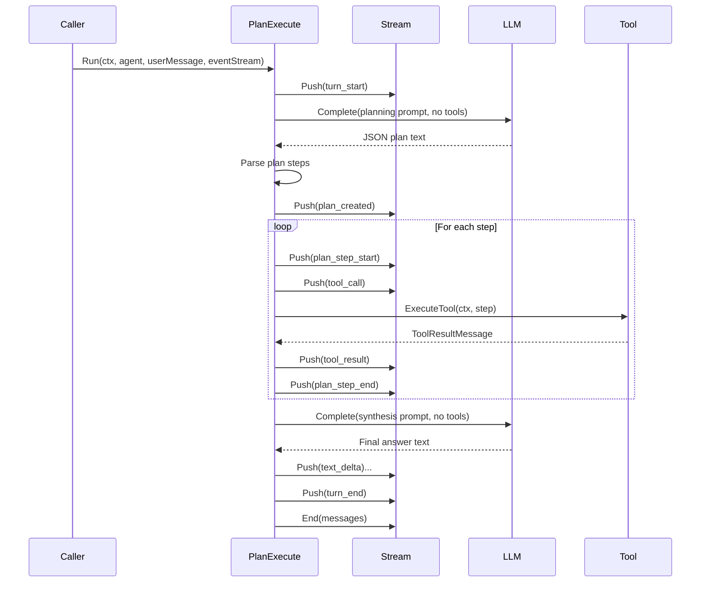
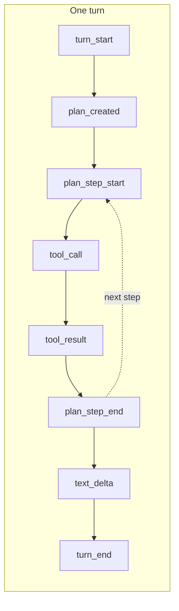

# Plan-and-execute orchestrator

Turn loop in three phases: **plan** (one LLM call → structured JSON plan of tool steps), **execute** (run each step via the tool registry), **synthesize** (one LLM call → final natural-language answer). No steering loop; the plan is fixed after the first LLM response (empty or invalid plan falls back to synthesis only). The main agent can still **rectify tool or delegation failures** when it sees errors or traces in tool results (e.g. during synthesis or in follow-up), and retry with intent.

## Event pattern

Events are pushed in a fixed order: turn start → plan created → for each step (plan_step_start, tool_call, tool_result, plan_step_end) → text_delta (synthesis) → turn_end.

### Sequence diagram



### Event flow (linear view)



### Event types emitted

| Event | Payload | When |
|-------|---------|------|
| `turn_start` | `TurnStartPayload` (Timestamp) | Start of turn |
| `plan_created` | `PlanCreatedPayload` (StepCount, Steps) | After parsing the planning LLM response (Steps = list of PlanStepInfo: Tool, Args) |
| `plan_step_start` | `PlanStepStartPayload` (Index, StepCount, Tool, Args) | Before each plan step execution |
| `tool_call` | `ToolCallPayload` (ToolCallId, ToolName, Args) | Before each tool execution (same as agentic) |
| `tool_result` | `ToolResultPayload` (ToolCallId, ToolName, Result, Error) | After each tool execution |
| `plan_step_end` | `PlanStepEndPayload` (Index, StepCount, Tool, Result, Error) | After each plan step execution |
| `text_delta` | `TextDeltaPayload` (Text, Index) | Chunks of the synthesis LLM reply |
| `turn_end` | `TurnEndPayload` (Message, Duration) | When the turn finishes |

This orchestrator does **not** emit `steering_mode` or `thinking`; those are used by the agentic orchestrator.

### Example event sequence (two-step plan)

```
turn_start
plan_created { stepCount: 2, steps: [{ tool: "get_current_time", args: {} }, { tool: "calculator", args: { expression: "10+5" } }] }
plan_step_start { index: 0, stepCount: 2, tool: "get_current_time" }
tool_call { toolName: "get_current_time", args: {} }
tool_result { result: "2025-02-15T12:00:00Z" }
plan_step_end { index: 0, stepCount: 2, tool: "get_current_time", result: "..." }
plan_step_start { index: 1, stepCount: 2, tool: "calculator" }
tool_call { toolName: "calculator", args: { expression: "10+5" } }
tool_result { result: 15 }
plan_step_end { index: 1, stepCount: 2, tool: "calculator", result: 15 }
text_delta "The time is 12:00 and 10+5 = 15."
turn_end
```

## Usage

Set `AgentConfig.Orchestrator` to the plan-execute orchestrator (it does not register as default):

```go
import "github.com/biome/agent-core/packages/agent/orchestrators/planexecute"

agent := core.NewAgent(core.AgentConfig{
    SystemPrompt: "You are a helpful assistant.",
    Provider:     provider,
    Tools:        registry,
    Orchestrator: planexecute.Default(),
})
```

Consumers can branch on `plan_created`, `plan_step_start`, and `plan_step_end` to show plan progress and step indices (e.g. "Step 1/3").
